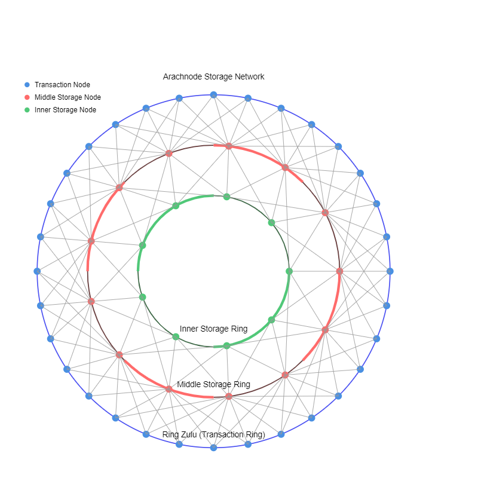

# Arachnode: A Scalable Concentric Ring-Based Storage Network

**Arachnode** is a scalable distributed storage system designed around concentric rings, each of which is a Kademlia based Distributed Hash Table (DHT).  Nodes dynamically adjust their storage responsibility based on capacity and demand. The architecture balances load across a hierarchy of rings, with each ring representing a progressively smaller partition (wider range) of the keyspace. This design ensures efficient storage and retrieval of data, dynamically balancing load as nodes join or leave the network.

By separating transaction and storage responsibilities, Arachnode can achieve high transaction throughput, without compromising consistency and durability.  Its architecture resembles a **spider's web**, with each ring interconnected to maintain continuity, scalability, and resilience.

## **Key Components of Arachnode**

### **Rings Overview**
- **Ring Zulu**: The **transaction ring**. This ring handles operations where nodes manage key ranges proximal to the node's ID, determined by an overlap factor, typical of Kademlia DHTs. Nodes in this ring handle transaction verification and forward data to inner storage rings based on partitioning.  They are not required to store data long-term but should at least be capable of minimal data caching.
- **Ring 0 (Innermost Storage Ring)**: Because the **innermost ring** represents the entire keyspace, every storage node in this ring stores **all data** within the system.  Nodes will only be present in this ring if the total storage requirements of the system are less than the capacity of a single node.
- **Outer Storage Rings**: Rings 4, 8, ..., n. These rings represent increasing levels of partitioning, where each ring corresponds to a progressively finer subdivision of the keyspace based on most significant bits (MSBs). As nodes move outward from Ring 0, their responsibility becomes more granular, storing only smaller portions of the keyspace.  As a node reaches storage capacity, it moves outward into one of the outer storage rings.  A node can also move inward if it is under utilized and is capable of handling a larger portion of the keyspace.  Rings may be sparse or empty - as networks grow in size, the inner rings will generally grow more sparse.  It's worth noting that outer numbered rings could be more populated than Ring Zulu, because the storage requirements of the transaction node's overlap may exceed the range represented by the overlap.

### **Ring Membership**
- A given storage node may participate both in a storage ring, as well as the transaction ring, using the same address.
- A node will not join at multiple storage rings, except during transition.

---

## **Node Operations in Arachnode**

### **Joining the Network**
- A node, whether intending to be a storage node or not, first queries and joins the transaction ring at its own ID, as is standard for Kademlia DHTs.
- A node which wishes to participate in storage, beyond the overlapping range of the transaction ring, can elect to either remain in the transaction ring and also join a storage ring, or may leave the transaction ring and only participate in storage.  This decision may be based, for instance, on the network latency of the node, or the speed of the node's storage.  Whichever data are stored by transaction nodes should be quickly available.
- If a transaction node reaches its storage capacity for the range it represents, it may want to use a recency / frequency based cache scheme to expire elements from its storage.

### **Storage Ring Adjustment**
- Based on known storage nodes at a node's present location, the node determines if it can handle storage at referenced storage rings.
  - If so, the node joins the storage ring in partial status, and begins to incrementally load data from neighboring nodes.
  - If not, if the node has capacity for storage beyond Ring Zulu, it starts its own ring at the outermost storage ring and incrementally loads a slice of the keyspace from inner nodes.
- Once populated, the node switches to complete status.
- Based on network activity and node capacity, the node can continue to move inward if it is under utilized, or outward if it is nearing capacity.

### **Propagation of Storage Messages**
- **Transaction Initiation (Ring Zulu)**: When a transaction (such as a key-value write) is initiated, it is first processed by the overlapping nodes in **Ring Zulu**. These nodes handle the transaction logic (e.g., verifying the write), persist the data to a log, and then forward the storage message to reachable storage nodes.
  - **Transaction Logging**: Transaction nodes should persist the transaction to a log at a minimum, so that transactions can be recovered in the event of a crash (durability).
- **Propagation within Storage Rings**:
  - Storage nodes receive and store the data based on their partition responsibility.
  - The message is forwarded in both directions between adjacent nodes in each ring until the some number of peers report having seen the message, or the edge of the partition is reached.
  - The message is also forwarded inward to reachable nodes in the next more general storage rings.
- **Q**: is there some combination of push and pull to avoid flooding and to enable self-repair?

### **Querying**
- **Transaction Nodes First**: When querying for data, the message is always first directed at the storage (cache or full) of Ring Zulu.
- **Fallback to Storage**: If the data are absent at Ring Zulu, the request is propagated inward, starting with the reachable storages nodes, which should be in the most granular ring at this address.
- **Breadth-First Search**: If a node cannot fulfill a query (due to capacity limits or keyspace restrictions), it responds with potential inner, peer, or outer ring nodes which might be able to fulfill the request.  This always flows back to the transaction nodes, which proceed with the query in a breadth-first manner.
  - **Failure**: If all storage nodes fail to respond, the transaction nodes will cache the failure and respond to the querier.
  - **Success**: If the data are found, the transaction nodes will respond to the querier with the data and will broadcast the missing data to any storage nodes that are responsible, but failed the search.

---

## **Bit Increment Between Rings**

- Storage rings are located every **1 bit**, meaning each subsequent ring divides the keyspace into **2^1 = 2 partitions**. This allows the rings to scale logarithmically while keeping the system manageable.
  - **Ring 0**: No partitioning, stores all data.
  - **Ring 1**: Based on the first 1 MSB, dividing the keyspace into 2 segments.
  - **Ring 8**: Based on the first 8 MSBs, dividing the keyspace into 256 segments.
  - **Ring 16**: Based on the first 16 MSBs, dividing the keyspace into 65536 segments.

The **1-bit increment** strikes a balance between partitioning granularity and the number of nodes within each ring.  If a storage node is nearing capacity, it can move outward and be responsible for 1/2 as much data.  If the node is under utilized, it can move inward and take on twice as much data.

---

## **References Between Rings**

Each node maintains **references to nodes** in both inner and outer rings:
1. **Inner and Outer References**: These references point to nodes responsible for the same partition in **inner rings** (i.e., broader partitions) and **outer rings** (i.e., more granular partitions). These allow a node to propagate data inward to store or to query data, or to join a different ring if desired.
2. **Buckets**: Each node maintains a max sizes bucket for inner, and a separate bucket for outer references.

---

## **Capacity Management and Ring Adjustment**

### **Global Storage Demand Management**:
- **Overlap Factor Sampling**: Arachnode periodically samples the **overlap factor** (the number of storage nodes responsible for any given key) across the rings. 
  - A high overlap factor signals an over abundance of storage, suggesting that **fewer** storage resources are needed.
  - A low overlap factor signals that **more** storage resources are needed.

### **Global Transaction Demand Management**:
- **Cache Coverage Sampling**: Arachnode periodically samples the **cache coverage** (the percentage of keys that are present in the cache) across the rings.
  - A low cache coverage suggests that **more** transaction nodes are needed.
- **Transaction Latency Sampling**: Arachnode periodically samples the **transaction latency** (the time it takes to complete a transaction) across the rings.
  - A high latency suggests that **more** transaction nodes are needed.
  - A low latency suggests that **fewer** transaction nodes are needed.

