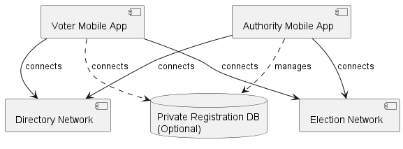

# VoteTorrent Technical Architecture

## Overall Requirements

* Election authority can advertise and revise election including timeframes and keyholders
* The list of registered voters could be fixed at start of election, or grow until closing
* District authorities can publish and revise ballot templates
* Registrant maintains a public and private key - private key is optimally held in a hardware vault
* Registrant detail may be comprised of public and private attributes, neither of which can be tampered with without detection
* Authority may retain actual private information on voters, but any tampering will change the hash and be detected
* The stakeholders can see public portion (if any) of voter registration
* Voter can vote without the authority, peers, or any other party knowing for which candidate
* Revealing election results requires all election keyholders to publish their election keys at the appointed timeframe
* Voter can verify presence and correctness of his or her vote
* Stakeholders can verify that only eligible voters voted
* Stakeholders can verify the final tally
* Stakeholders can tell which voters voted, but not what for
* No party should be able to vote on behalf of the voter - there may be restrictions on how far this is possible
* All voters may participate in validation of election results, and such validation results are made available to stakeholders

## Subsystems

* **Directory Network ("Directory")**
  * Architecture: Peer-to-peer network based on Kademlia DHT
  * Scope: Global
  * Stores: authority records, including election network references
  * Storage timeline: long-term - changes occasionally as geographic election districts change
  * Node types: Transaction only (mobile app on mobile network or limited storage), Storage (server or cloud service - long term storage)
* **Election Network**
  * Architecture: Peer-to-peer network based on Kademlia DHT
  * Scope: Election wide (e.g. per state)
  * Stores: election related records
  * Storage timeline: during election period - archivers may keep records longer
  * Node types: Transaction only, Storage
* **Voter mobile app**
  * User: voters
  * Connects to: Directory and Election Networks
  * Facilitates: registration, voting, validation, and viewing results
* **Authority mobile app**
  * User: election administrators
  * Connects to: Directory and Election Networks
  * Facilitates: creation and revising of elections, ballot templates, authority administration, and keyholding
* **Private registration database (optional)**
  * User: election authority
  * Facilitates: storage of private registration information; validation that private CID matches stored information
  * Interface: Rest API

## Peer to Peer Networks

The heart of VoteTorrent is the peer-to-peer network, which is based on the Kademlia DHT.  A Kademlia DHT is a distributed hash table that allows nodes to find each other and exchange information.

Each network varies in terms of what specific information is stored and exchanged, but the core protocols are the same.  The core protocols of VoteTorrent networks are:
* **Distributed Database System - Optimystic** - the network cooperatively acts as a database, holding collections of elections, registration, voting, validation, or whatever is being tracked by that network.  
* **Peer-to-peer matchmaking** - efficiently find other peers who are interested in performing cooperative tasks, such as forming a voting block.

## Distributed Database System - Optimystic

The Optimystic system uses a logical transaction log combined with block-based storage to provide a distributed database system. This scheme can be used standalone or coupled with tree or other data structures, supporting both single-collection and cross-collection transactions through a multi-phase process for propagating updates, committing transactions, and checkpointing affected blocks.

For details, see [optimystic](optimystic.md).

## Matchmaking

VoteTorrent's peer-to-peer network employs a rendezvous-based matchmaking system to efficiently connect peers for various tasks, regardless of network size or task popularity. The core concept involves nodes meeting at localized rendezvous points, with rendezvous keys derived from a combination of local node address information and task-specific hashes. Peers can adjust the specificity of these keys based on their local Kademlia bucket distribution and network conditions, allowing for adaptive control over the search and matchmaking process.

The matchmaking process differs for active matchers and waiting workers. Active matchers generate rendezvous keys, publish their intent, search for matches, and adjust key specificity as needed to find suitable peers quickly. Workers, on the other hand, register their availability with longer Time-To-Live (TTL) values and wait for work assignments, adjusting their specificity to balance the load at rendezvous points. This flexible system can handle various scenarios, from sparse networks with few interested peers to dense networks with many participants, by dynamically adjusting the rendezvous key specificity to optimize peer discovery and work distribution.

For details, see [matchmaking](matchmaking.md).

## Election Logic

Election structures are stored using the Optimystic distributed database system.  Vote blocks are appended to the vote tree collection, and a pointer to the block is noted in the registration tree collection.  Vote block formation is coordinated using the Matchmaking system.  Once the voting period is over, the vote collection is hashed.

See [Election Logic](election.md) for details on the election processes.

## Glossary of Terms

* **Administrator** - a person who, in combination with the other administrators, is authorized to act on behalf of an authority.
* **Authority** - district or entity involved in the voting process
  * **Election Authority** - the authority describing the overall event and timetable
  * **Registration Authority** - an authority charged with tracking registered voters
  * **Ballot Authority** - a district level authority with a specific ballot template to be voted on in an election 
  * **Certification Authority** - an authority that certifies the result of each ballot question per election
* **Ballot Template** - a declaration of a specific questionnaire pertaining to a Ballot Authority and Election.
* **Block** - batch of voters and votes, with scrambled ordering so votes aren't related to voters.  Has been hashed and uniqueness validated.
* **DHT/Kademlia** - Distributed Hash Table - network used to communicate and transact on a peer-to-peer basis (no central server)
* **District** - a geographic area represented by a Ballot Authority
* **Election** - declaration of a pending voting event, containing the cut-off times, and associated rules
* **Outcome** - the tallied results of a given ballot within an election
* **Pool** - a forming block - not fully mature
* **Registration** - list of eligible voters, maintained by an authority or peer to peer network
* **Stakeholders** - the authority, usually the voters, and any other parties who are privy to the voter registration and vote outcome
* **Seed** - an initial block of three anonymously formed voters/votes
* **Timestamp Authority** - a trusted third party that provides a timestamp

## General Notes:

* Standard JSON format for all major objects
* Markdown for content embeddings
