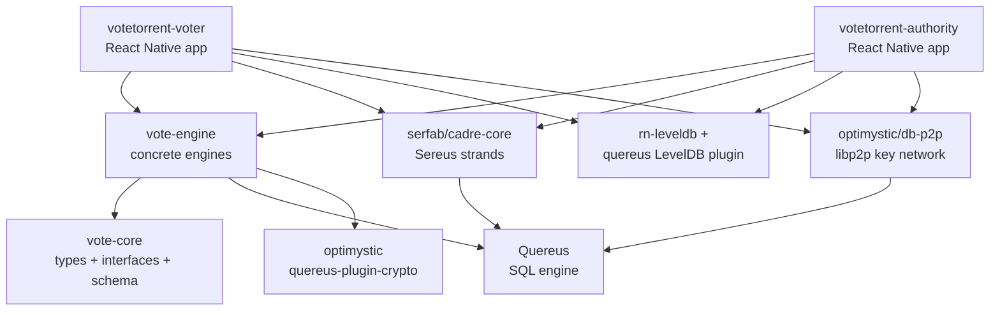
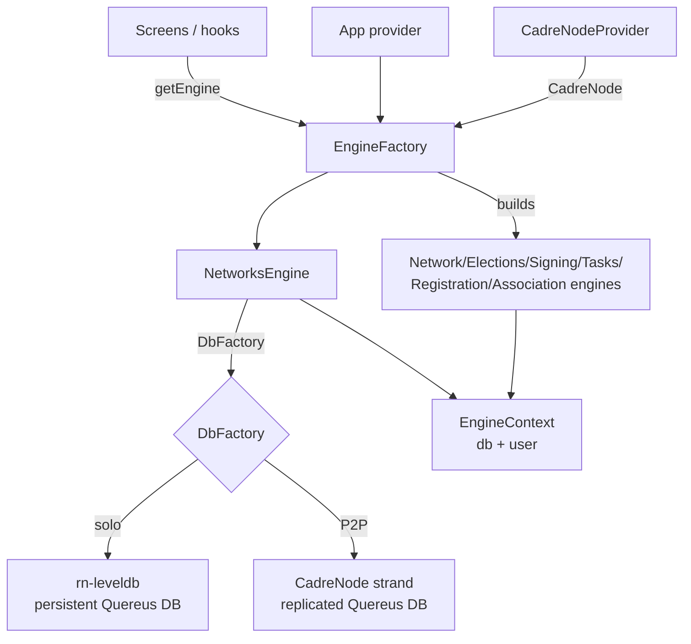

# Codebase Architecture

How the VoteTorrent **repository** is organized — its workspaces, the
responsibility of each package and app, the external dependencies it builds on,
and how the pieces compose at runtime.

This is the complement to [Technical Architecture](architecture.md), which
describes the **protocol** (subsystems, networks, requirements), and to
[Election Logic](election.md), which describes the election processes. This
document is about the code.

## System overview

VoteTorrent is a TypeScript ESM monorepo managed with Yarn 4 workspaces
(`"type": "module"`, `node >=20.19`, `yarn@4.7.0`). It produces two publishable
libraries and two React Native reference applications:

- **`@votetorrent/vote-core`** — shared types, domain models, and the engine
  *interfaces*. Also the canonical SQL schema.
- **`@votetorrent/vote-engine`** — the concrete implementation of those
  interfaces, backed by a Quereus SQL database over a pluggable database
  factory.
- **`votetorrent-voter`** — the Voter app: registration, device association,
  ballots, casting a vote.
- **`votetorrent-authority`** — the Authority app: networks, authorities,
  elections, keyholding.

The architectural style is a layered separation between *contract*
(`vote-core`), *behavior* (`vote-engine`), and *platform/composition* (the
apps). The lower layers are runtime-agnostic: everything React Native-specific
or peer-to-peer-specific is confined to the app layer. Data is modeled as SQL
tables in a single declared schema and accessed through engine classes; the
underlying storage and networking are injected at the app boundary.

## Workspace layout

```
votetorrent/
├── packages/
│   ├── vote-core/          @votetorrent/vote-core   (library)
│   ├── vote-engine/        @votetorrent/vote-engine (library)
│   └── p2p-probe-host/     p2p-probe-host           (dev-tooling drone)
├── apps/
│   ├── VoteTorrentVoter/     votetorrent-voter      (React Native app)
│   └── VoteTorrentAuthority/ votetorrent-authority  (React Native app)
├── patches/                human-readable notes for the .yarn/patches entries
├── .yarn/patches/          yarn patch: files applied to upstream packages
├── scripts/                guards, on-device proofs, fastlane signing
└── web/                    votetorrent.org static site
```

| Workspace | Package | Type | Entry |
| --- | --- | --- | --- |
| `packages/vote-core` | `@votetorrent/vote-core` | Published library | `dist/src/index.js` |
| `packages/vote-engine` | `@votetorrent/vote-engine` | Published library | `dist/index.js` (+ `./rn` subpath → `dist/rn-entry.js`) |
| `packages/p2p-probe-host` | `p2p-probe-host` | Private dev tool | `drone.mjs` |
| `apps/VoteTorrentVoter` | `votetorrent-voter` | Private app | React Native (Metro) |
| `apps/VoteTorrentAuthority` | `votetorrent-authority` | Private app | React Native (Metro) |

The root `workspaces.nohoist` list keeps React Native, React Navigation,
i18next, and Babel out of the hoisted root `node_modules` so each app resolves
its own copies — a requirement of the Metro bundler.

## Workspace graph



Dependency direction is strictly downward: `vote-core` depends on nothing in the
repo; `vote-engine` depends only on `vote-core` (plus Quereus and the crypto
plugin); the apps depend on both and add the platform/P2P stack. Notably, **no
React Native, Sereus, or storage dependency enters `packages/vote-engine`** —
those live in the app layer behind injected factories (see
[Runtime composition](#runtime-composition)).

## Packages

### `@votetorrent/vote-core` — contracts and types

The source of truth for the domain model. It exports types, models, and the
engine *interfaces*, but holds no concrete engine logic. Its `src/index.ts`
re-exports a set of domain-scoped barrels, each a folder under `src/`:

| Module | Responsibility |
| --- | --- |
| `authority/` · `authority-config/` | Authorities, administrators, officers, and their configuration |
| `network/` · `networks/` | A single network, and the collection / recents of networks |
| `election/` · `elections/` | A single election, and the collection of elections |
| `registration/` | Voter registration records and rules |
| `association/` | Device association and attestation |
| `signing/` | Signing sessions and signature primitives |
| `invite/` | Authority / officer / keyholder invitations |
| `tasks/` | Onboarding, key-release, and signature task queues |
| `user/` | User records and keys |
| `subscription/` | Live-query subscription interfaces |
| `common/` | Shared primitives: `IBuilder`, cursors, signatures, media refs, threshold policies, `LocalStorage`, errors |

Each module's `types.ts` declares the `IXxxEngine` interface the engine must
implement; its `models.ts` declares the plain data shapes. The
`common/builder.ts` `IBuilder<TInput, TOutput>` contract underpins the
form-builder pattern used throughout both app UIs. Runtime dependencies are
minimal: `@libp2p/interface`, `@libp2p/peer-id`, `uint8arrays`.

The **canonical SQL schema** lives here too, at `schema/votetorrent.qsql` — a
single Quereus DDL file (`declare schema main { ... } apply schema main;`)
defining every domain table and its constraints.

### `@votetorrent/vote-engine` — concrete engines

Implements the `vote-core` interfaces against a Quereus `Database`. Its
structure mirrors `vote-core`: each domain folder holds an engine, a mock
engine, and a `builders/` directory.

- **Engines** implement the `IXxx` interfaces by issuing SQL through a shared
  `EngineContext` — `networks-engine.ts`, `network-engine.ts`,
  `elections-engine.ts`, `election-engine.ts`, `signing-engine.ts`,
  `authority-engine.ts`, `user-engine.ts`, `registration-engine.ts`,
  `association-engine.ts`, the `tasks/*-engine.ts`, and
  `invite/invitation-engine.ts`.
- **Mock engines** (`mock-*.ts`) are in-memory implementations used by tests and
  by UI development ahead of the real path.
- **Builders** (`*/builders/*-builder.ts`) implement the `IBuilder` contract:
  immutable drafts with per-setter and cross-field validators that produce a
  validated payload and `commit()` it through an engine.

The database tier lives under `src/database/`:

- `schema-sql.ts` — the schema DDL bundled as a **string constant**
  (`VOTETORRENT_SCHEMA_SQL`), generated from `vote-core/schema/votetorrent.qsql`.
  A string rather than a file read because Hermes cannot parse `import.meta` and
  has no Node `fs`.
- `initialize.ts` — `registerDbPlugins` (the
  `@optimystic/quereus-plugin-crypto` plugin plus custom `SignatureValid` /
  `isISODatetime` SQL functions), `initDB`, and the schema-version helpers that
  gate create-vs-reattach.
- `tid-allocator.ts`, `digest-vectors.ts`, `migrations/`.

Two abstractions in `src/types.ts` decouple the engine from the runtime:

- **`EngineContext`** — `{ db: Database; user?: User }`, the per-network handle
  engines operate on.
- **`DbFactory`** — `(networkHash: string) => Promise<Database>`, the injected
  factory producing a `Database` for a network. The engine's only built-in
  factory is an in-memory `new Database()`; the persistent and P2P factories
  live in the apps.

The package has **two entry points**. The default `.` barrel (`src/index.ts`)
deliberately omits `NetworksEngine`. The React Native subpath
`@votetorrent/vote-engine/rn` (`src/rn-entry.ts`) is the single controlled
export path exposing `NetworksEngine` and the other concrete engines, plus the
attestation verifiers, `LocalStorageReact`, and the `DbFactory` /
`EngineContext` types.

Device attestation has two dedicated documents:
[`ATTESTATION-CONTRACT.md`](../packages/vote-engine/ATTESTATION-CONTRACT.md)
(the `Digest(nonce, deviceKey)` wire format shared with the Voter app) and
[`SETUP.md`](../packages/vote-engine/SETUP.md) (the human-only runbook for
provisioning Play Integrity / key attestation).

### `p2p-probe-host` — dev-tooling drone

A private workspace containing a host-side CadreNode "drone" (`drone.mjs`) used
by the dial and replication proofs. Not published, not part of any app runtime.
The shell drivers under `scripts/` coordinate the proofs — see
[Development](development.md#on-device-proofs).

### The apps

Both apps depend on the two libraries via `workspace:*` and supply everything
platform-specific. They share a `src/` shape:

| Directory | Responsibility |
| --- | --- |
| `engines/` | Composition layer: `EngineFactory`, the persistent `DbFactory` (`rn-db-factory.ts`), device user/signer, storage guard, and the on-device proof runners |
| `providers/` | React context providers — app/engine lifecycle, `CadreNodeProvider` (boots the Sereus CadreNode), settings |
| `navigation/` | React Navigation root navigator and route types |
| `screens/` | Feature screens grouped by domain |
| `components/` · `hooks/` · `theme/` · `i18n/` · `utils/` | Shared UI and cross-cutting concerns |

Where they differ: the **Authority** app adds `SettingsProvider` plus the
keyholder and admin screens, and pins the Voter app's package name and signing
certificate digest for attestation (`engines/attestation-*.generated.ts`). The
**Voter** app adds the attestation *producer* side
(`engines/attestation-producer.ts`), a dev seed, and the registration/ballot
draft providers.

Outside `src/`, each app root holds the platform projects (`android/`, `ios/`),
`metro.config.js` with its `polyfills.bootstrap.js` / `polyfills/` for the
Node-style globals the P2P and SQL stack expects under Hermes, and the build
entry (`index.js` → `App.tsx`). The Metro configuration carries several
load-bearing workarounds documented in
[Development](development.md#react-native--hermes-constraints).

## External dependencies

VoteTorrent builds on three external technology families, all consumed as
**published packages** from the registry:

- **Quereus** (`@quereus/quereus`, `@quereus/store`, `@quereus/isolation`) — the
  embedded SQL engine. Every engine operates on a Quereus `Database`. The apps
  add `@quereus/plugin-react-native-leveldb` for the on-device persistent
  backend.
- **Sereus** (`@serfab/cadre-core`, `@serfab/quereus-plugin-sereus`,
  `@serfab/strand-proto`) — the P2P "strand" layer. A `CadreNode` manages
  control networks and strand participation; a strand exposes a Quereus
  `Database` whose tables replicate across peers.
- **Optimystic** (`@optimystic/db-core`, `@optimystic/db-p2p`,
  `@optimystic/db-p2p-storage-rn`, `@optimystic/quereus-plugin-crypto`,
  `@optimystic/quereus-plugin-optimystic`) — the distributed database and key
  network. `db-p2p` provides `Libp2pKeyPeerNetwork` (an `IKeyNetwork` over
  libp2p); `db-p2p-storage-rn` provides the React Native LevelDB backend. The
  design docs for this layer live in the
  [Optimystic repository](https://github.com/gotchoices/Optimystic/tree/main/docs).
- **libp2p** — the underlying transport (Kademlia DHT, WebSockets, circuit
  relay), wired in by the Sereus and Optimystic layers.

Sereus and Optimystic are co-developed alongside VoteTorrent. They were
previously consumed as in-repo vendored `portal:` copies under `vendor/`; that
model was retired once the upstream packages stabilized on the registry. The
root `resolutions` now pin them to published version ranges, alongside pins that
collapse shared low-level libraries (`uint8arrays`, `@noble/*`, `@libp2p/*`,
`@multiformats/multiaddr`) onto a single copy each.

### Patches

A few upstream packages still need source-level fixes, applied via `yarn patch`,
recorded under `.yarn/patches/` and referenced from the root `resolutions`.
Check `package.json` for the current set and versions; human-readable rationale
for individual patches lives under [`patches/`](../patches).

## Build pipeline

Root scripts fan out across all workspaces with
`yarn workspaces foreach -A run <script>`:

| Root command | What it does |
| --- | --- |
| `yarn build` | Each workspace's `build` — `vote-core` via aegir, `vote-engine` via `tsc -p tsconfig.build.json`, apps via fastlane/Gradle |
| `yarn test` | Each workspace's `test` — `vote-core` aegir, `vote-engine` Mocha, apps Jest |
| `yarn lint` | `scripts/check-peer-requirements.mjs`, then each workspace's `lint` |
| `yarn clean` | Each workspace's `clean` |

Plus per-app shortcuts (`start`/`android`/`ios` and their `:voter` variants) and
the release chain (`verify:keystore`, `build:apk`, `publish:apk`,
`release:apk`). See [Development](development.md) for the guard scripts and
[Android builds and releases](releases/RELEASE-ANDROID.md) for signing.

## Runtime composition

At runtime the layers compose through dependency injection at the app boundary.
The provider tree nests `Settings → CadreNode → App`, and the engine wiring
flows as follows:



1. **`CadreNodeProvider`** boots a Sereus `CadreNode` for the app lifetime (P2P
   over libp2p WebSockets / circuit relay), persisting the peer key across
   restarts. It is the only place `@serfab/cadre-core`,
   `@optimystic/db-p2p-storage-rn`, and `rn-leveldb` are imported for the node
   lifecycle.
2. **The app provider** owns one app-lifetime `EngineFactory`, constructed with
   a `LocalStorageReact` and the persistent `rnDbFactory`.
3. **`EngineFactory`** (`src/engines/engine-factory.ts`) is the single
   construction point for all engines. It builds one `NetworksEngine`, injecting
   a lazy-dispatch `DbFactory` that delegates to the strand factory when a
   CadreNode is present (the real P2P path) and falls back to the solo
   LevelDB-backed factory otherwise. It then lazily builds and caches the
   sibling engines from the established `EngineContext`.
4. **`NetworksEngine`** owns the per-network `EngineContext` lifecycle:
   `create()` runs the schema DDL on a fresh store and writes the
   schema-version marker; `open()` is cache-first and re-attaches to an
   already-initialized store. Both route exclusively through the injected
   `DbFactory`, so the engine never imports a platform or P2P dependency
   directly.
5. **Sibling engines** receive that `EngineContext` and issue SQL against its
   `Database`.

The result is a clean seam: the same engine code runs over an in-memory database
in tests, a persistent LevelDB database when solo on-device, and a
peer-replicated Sereus strand when connected — selected entirely by which
`DbFactory` the app injects. For the protocol design behind those networks, see
[architecture.md](architecture.md).
