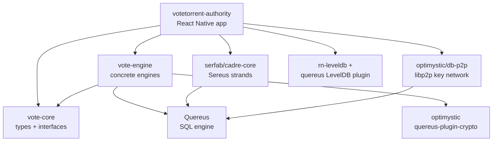
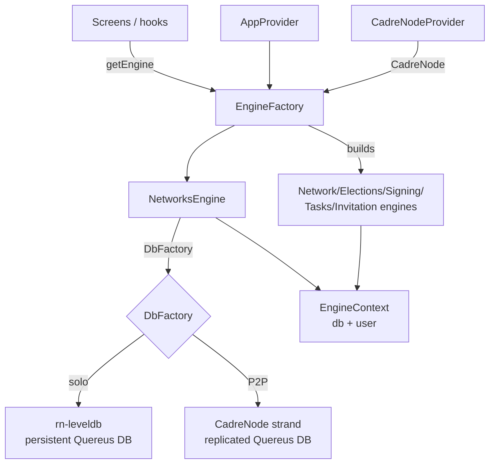

# Codebase Architecture

This document describes how the VoteTorrent **repository** is organized — its
workspaces, the responsibilities of each package and app, the external
dependencies that are vendored or patched, the build pipeline, and how the
pieces compose at runtime.

It is the complement to the [Technical Architecture](architecture.md) document,
which describes the **protocol** (subsystems, networks, requirements). For
protocol and network design see that doc; for the distributed database layer see
[Optimystic](optimystic.md) and [Repository](repository.md); for the election
processes see [Election Logic](election.md). This document focuses on the code.

## System Overview

VoteTorrent is a TypeScript ESM monorepo managed with Yarn 4 workspaces
(`"type": "module"`, `node >=20.19`, `yarn@4.7.0`). It produces two publishable
libraries and one React Native reference application:

- A **core library** (`@votetorrent/vote-core`) that defines the shared types,
  interfaces, and protocol primitives.
- An **engine library** (`@votetorrent/vote-engine`) that provides the concrete
  implementation of those interfaces, backed by a SQL engine (Quereus) over a
  pluggable database factory.
- A **React Native app** (`votetorrent-authority`) that wires the engine into a
  device, supplies the platform-specific database and P2P layers, and renders
  the administrator UI.

The architectural style is a layered separation between *contract*
(`vote-core`), *behavior* (`vote-engine`), and *platform/composition* (the app).
The lower layers are runtime-agnostic; everything React Native-specific or
peer-to-peer-specific is confined to the app layer. Data is modeled as SQL
tables in a single declared schema and accessed through engine classes; the
underlying storage and networking are injected at the app boundary.

## Workspace Layout

Source lives under two workspace roots declared in the root `package.json`:
`packages/*` and `apps/*`.

```
votetorrent/
├── packages/
│   ├── vote-core/          @votetorrent/vote-core   (library)
│   ├── vote-engine/        @votetorrent/vote-engine (library)
│   └── p2p-probe-host/     p2p-probe-host           (dev-tooling drone)
├── apps/
│   └── VoteTorrentAuthority/  votetorrent-authority (React Native app)
├── vendor/                 in-repo copies of @serfab/* and @optimystic/* deps
├── patches/                human-readable notes for the .yarn/patches entries
├── .yarn/patches/          yarn patch: files applied to upstream packages
└── scripts/                build / vendor-sync / verification tooling
```

| Workspace | Package | Type | Entry |
| --- | --- | --- | --- |
| `packages/vote-core` | `@votetorrent/vote-core` | Published library | `dist/src/index.js` |
| `packages/vote-engine` | `@votetorrent/vote-engine` | Published library | `dist/index.js` (+ `./rn` subpath → `dist/rn-entry.js`) |
| `packages/p2p-probe-host` | `p2p-probe-host` | Private dev tool | `drone.mjs` |
| `apps/VoteTorrentAuthority` | `votetorrent-authority` | Private app | React Native (Metro) |

The root `workspaces.nohoist` list keeps React Native, React Navigation,
i18next, and Babel out of the hoisted root `node_modules` so the app resolves
its own copies — a requirement of the Metro bundler.

## Workspace Graph



Dependency direction is strictly downward: `vote-core` depends on nothing in the
repo; `vote-engine` depends only on `vote-core` (plus Quereus and the crypto
plugin); the app depends on both and adds the platform/P2P stack. Notably,
**no React Native, Sereus, libp2p, or storage dependency enters
`packages/vote-engine`** — those live exclusively in the app layer behind
injected factories (see [Runtime Composition](#runtime-composition)).

## Packages

### `@votetorrent/vote-core` — contracts and types

The core library is the source of truth for the domain model. It exports types,
models, and the engine *interfaces* but holds no concrete engine logic. Its
`src/index.ts` re-exports a set of domain-scoped barrels, each a folder under
`src/`:

| Module | Responsibility |
| --- | --- |
| `authority/` | Authorities, administrators, officers |
| `network/` · `networks/` | A single network and the collection / recents of networks |
| `election/` · `elections/` | A single election and the collection of elections |
| `signing/` | Signing sessions and signature primitives |
| `invite/` | Authority / officer / keyholder invitations |
| `tasks/` | Onboarding, key-release, and signature task queues |
| `user/` | User records and keys |
| `subscription/` | Live-query subscription interfaces |
| `common/` | Shared primitives: `IBuilder`, cursors, signatures, image/video refs, threshold policies, `LocalStorage`, errors |

Each `types.ts` declares the `IXxxEngine` interface the engine must implement
(for example `INetworksEngine` in `src/networks/types.ts`), and `models.ts`
declares the plain data shapes (`NetworkInit`, `NetworkReference`, `User`, …).
The `common/builder.ts` `IBuilder<TInput, TOutput>` contract underpins the
form-builder pattern used throughout the UI. Runtime dependencies are minimal:
`@libp2p/interface`, `@libp2p/peer-id`, and `uint8arrays`.

The canonical SQL schema lives here as well, at
`packages/vote-core/schema/votetorrent.qsql` — a single Quereus DDL file
(`declare schema main { ... } apply schema main;`) defining all domain tables
(`Network`, `Authority`, `Admin`, `Officer`, `User`, `UserKey`, …) and their
constraints.

### `@votetorrent/vote-engine` — concrete engines

The engine library implements the `vote-core` interfaces against a Quereus
`Database`. The structure mirrors `vote-core`: each domain folder contains an
engine, a mock engine, and a `builders/` directory.

- **Engines** (`networks-engine.ts`, `network-engine.ts`, `elections-engine.ts`,
  `election-engine.ts`, `signing-engine.ts`, `authority-engine.ts`,
  `user-engine.ts`, `default-user-engine.ts`, the `tasks/*-engine.ts`, and
  `invite/invitation-engine.ts`) implement the `IXxx` interfaces by issuing SQL
  through a shared `EngineContext`.
- **Mock engines** (`mock-*.ts`) provide in-memory implementations used by tests
  and earlier UI development.
- **Builders** (`*/builders/*-builder.ts`) implement the `IBuilder` contract:
  immutable draft objects with per-setter/cross-field validators that produce a
  validated payload and `commit()` it through an engine (for example
  `NetworksCreateBuilder` delegates to `NetworksEngine.create`).

The engine's database tier lives under `src/database/`:

- `schema-sql.ts` — the schema DDL **bundled as a string constant**
  (`VOTETORRENT_SCHEMA_SQL`), auto-generated from
  `vote-core/schema/votetorrent.qsql`. It is a string (not a file read) so
  `initDB` works under Hermes, which cannot parse `import.meta` and has no Node
  `fs`.
- `initialize.ts` — `registerDbPlugins` (registers the `@optimystic/quereus-plugin-crypto`
  plugin plus custom `SignatureValid` / `isISODatetime` SQL functions),
  `initDB` (executes the schema), and the schema-version / TID-sequence helpers
  used to gate create-vs-reattach.

Two key abstractions decouple the engine from the runtime, both defined in
`src/types.ts`:

- `EngineContext` — `{ db: Database; user?: User }`, the per-network handle the
  engines operate on.
- `DbFactory` — `(networkHash: string) => Promise<Database>`, the injected
  factory that produces a `Database` for a given network. The engine's only
  built-in factory is an in-memory `new Database()`; the concrete persistent and
  P2P factories live in the app.

The package has two entry points. The default `.` barrel (`src/index.ts`)
deliberately **omits `NetworksEngine`**; the React Native subpath
`@votetorrent/vote-engine/rn` (`src/rn-entry.ts`) is the single controlled
export path that exposes `NetworksEngine` and the other concrete engines plus
`LocalStorageReact`, `DbFactory`/`EngineContext` types, `H16`, and
`VOTETORRENT_SCHEMA_SQL`. This keeps `NetworksEngine` out of non-RN consumers.

`vote-engine` builds with `tsc` directly (not aegir) and tests with Mocha. Its
`react`/`react-native`/`@react-native-async-storage` dependencies support the
React-backed `LocalStorageReact` adapter; they are also declared as
`peerDependencies`.

### `p2p-probe-host` — dev-tooling drone

A private workspace (`p2p-probe-host`) containing a host-side CadreNode "drone"
(`drone.mjs`) used for the P2P dial proof during development. It is not
published and not part of the app runtime; it depends on `@serfab/cadre-core`,
`@optimystic/db-p2p`, and `@libp2p/websockets`. The shell drivers under
`scripts/` (`run-dial-probe.sh`, `run-replication-proof.sh`,
`run-signing-proof.sh`, `run-vtest02.sh`) coordinate these proofs.

### `votetorrent-authority` — React Native app

The Authority app is the reference application for setting up networks,
authorities, and elections. It depends on both workspace libraries
(`@votetorrent/vote-core` and `@votetorrent/vote-engine` via `workspace:*`) and
supplies everything platform-specific. Its `src/` is organized as:

| Directory | Responsibility |
| --- | --- |
| `engines/` | Composition layer: `EngineFactory`, the persistent/strand `DbFactory` (`rn-db-factory.ts`), the strand key-network adapter (`key-network-strand.ts`), device user/signer, and the on-device proof runners |
| `providers/` | React context providers: `AppProvider` (engine lifecycle), `CadreNodeProvider` (boots the Sereus CadreNode), `SettingsProvider` |
| `navigation/` | React Navigation root navigator and route types |
| `screens/` | Feature screens grouped by domain (networks, authorities, elections, ballots, tasks, users, admin, keyholder, settings) |
| `components/` | Shared presentational components |
| `hooks/` · `theme/` · `i18n/` · `utils/` | Cross-cutting UI concerns |

Outside `src/`, the app root holds the platform projects (`android/`, `ios/`),
the Metro config (`metro.config.js`) with its polyfill bootstrap
(`polyfills.bootstrap.js`, `polyfills/`) for the Node-style globals the P2P/SQL
stack expects under Hermes, and the build entry (`index.js` → `App.tsx`).

## External & Vendored Dependencies

VoteTorrent builds on three external technology families, several pieces of
which are pinned into the repository rather than consumed straight from the
registry.

### The technology families

- **Quereus** (`@quereus/quereus`) — the embedded SQL engine. Every engine
  operates on a Quereus `Database`. The app additionally uses
  `@quereus/store`, `@quereus/isolation`, and
  `@quereus/plugin-react-native-leveldb` for the on-device persistent backend.
- **Sereus** (`@serfab/cadre-core`, `@serfab/quereus-plugin-sereus`,
  `@serfab/strand-proto`) — the P2P "strand" layer. A `CadreNode` manages
  control networks and strand participation; a strand exposes a Quereus
  `Database` whose tables are replicated across peers.
- **Optimystic** (`@optimystic/db-core`, `@optimystic/db-p2p`,
  `@optimystic/db-p2p-storage-rn`, `@optimystic/quereus-plugin-crypto`,
  `@optimystic/quereus-plugin-optimystic`) — the distributed database and key
  network. `@optimystic/db-p2p` provides `Libp2pKeyPeerNetwork` (an
  `IKeyNetwork` over libp2p), and `db-p2p-storage-rn` provides the React Native
  LevelDB storage backend. See [Optimystic](optimystic.md).
- **libp2p** — the underlying peer-to-peer transport (Kademlia DHT, WebSockets,
  circuit relay), wired in by the Sereus and Optimystic layers.

### Why these are vendored (`portal:` resolutions)

The root `package.json` `resolutions` field redirects the `@serfab/*` and
`@optimystic/db-*` packages to in-repo copies under `vendor/`:

```
"@serfab/cadre-core":            "portal:./vendor/@serfab/cadre-core",
"@serfab/quereus-plugin-sereus": "portal:./vendor/@serfab/quereus-plugin-sereus",
"@serfab/strand-proto":          "portal:./vendor/@serfab/strand-proto",
"@optimystic/db-core":           "portal:./vendor/@optimystic/db-core",
"@optimystic/db-p2p":            "portal:./vendor/@optimystic/db-p2p",
"@optimystic/db-p2p-storage-rn": "portal:./vendor/@optimystic/db-p2p-storage-rn"
```

These libraries are co-developed alongside VoteTorrent (the Sereus and
Optimystic working trees live as `../sereus` and `../Optimystic` siblings during
active development). Vendoring serves two goals:

1. **Reproducible clean-clone builds.** The vendored `dist/` is committed, so a
   fresh clone builds without the sibling source trees present.
2. **Version pinning of fast-moving co-dependencies.** A `portal:` resolution
   points the whole dependency graph at one known-good copy, avoiding registry
   drift while the upstream packages stabilize.

The maintainer-only `scripts/sync-vendor.sh` rebuilds the `@serfab` `dist/` from
the `../sereus` sibling and copies it into `vendor/@serfab/<pkg>/`; it is *not*
needed for a clean-clone build.

### Patches

A few upstream packages need source-level fixes applied via `yarn patch`,
recorded under `.yarn/patches/` and referenced from `resolutions`:

- `@quereus/quereus@3.3.0` — patched (used by both `vote-engine` and the app).
- `@optimystic/quereus-plugin-optimystic@0.13.5` — patched (composite-PK fix;
  the human-readable rationale is in `patches/optimystic-quereus-plugin-composite-pk.md`).
- `@serfab/cadre-core@0.7.1` — patched.

Other resolutions pin shared low-level libraries to single versions
(`uint8arrays` → `3.1.1`, `@noble/curves`/`@noble/hashes` → `2.2.0`,
`@libp2p/crypto`, `@multiformats/multiaddr`, etc.) so the transitive graph
converges on one copy of each.

## Build Pipeline

The root `package.json` scripts fan out across all workspaces with
`yarn workspaces foreach -A run <script>`:

| Root command | What it does |
| --- | --- |
| `yarn build` | Runs each workspace's `build` (`vote-core` via aegir, `vote-engine` via `tsc -p tsconfig.build.json`, the app via `bin/build.sh`) |
| `yarn test` | Runs each workspace's `test` (`vote-core` aegir, `vote-engine` Mocha, the app Jest) |
| `yarn lint` | Runs `scripts/check-peer-requirements.mjs`, then each workspace's `lint` |
| `yarn clean` | Runs each workspace's `clean` |
| `yarn start` / `android` / `ios` | Delegate to the `votetorrent-authority` workspace (Metro / React Native CLI) |

The `postinstall` and `lint:peers` hooks both run
`scripts/check-peer-requirements.mjs`, a guard that re-asserts the
`@optimystic/quereus-plugin-*` peer-dependency signal that the broad `YN0086`
filter in `.yarnrc.yml` would otherwise mask. `@votetorrent/vote-core` builds
and lints with **aegir**; `@votetorrent/vote-engine` compiles with `tsc`
directly; the app bundles through **Metro** (`metro.config.js`).

### Vendor / portal verification scripts

Three acceptance-gate scripts under `scripts/` keep the vendoring and portal
setup honest:

- **`verify-vendoring.sh`** — simulates the absence of the `../sereus` sibling
  (clean-clone condition), runs `yarn install` plus a Metro Android bundle, and
  asserts that `@serfab/cadre-core` resolves to the in-repo `vendor/` copy and
  that the bundle builds. Proves reproducibility from a clean clone.
- **`verify-portal-adoption.sh`** — runs `yarn install`, a Metro Android bundle,
  the `vote-engine` suite, and a published/portal boundary check (no leaked
  `@quereus/quereus` `portal:` references). Requires the sibling working trees.
- **`check-peer-requirements.mjs`** — the peer-dependency guard described above.

## Runtime Composition

At runtime the layers compose through dependency injection at the app boundary.
The provider tree in `App.tsx` nests
`SettingsProvider → CadreNodeProvider → AppProvider`, and the engine wiring flows
as follows:



1. **`CadreNodeProvider`** boots a Sereus `CadreNode` for the app lifetime
   (peer-to-peer transport over libp2p WebSockets / circuit relay), persisting
   the peer key across restarts. It is the only place `@serfab/cadre-core`,
   `@optimystic/db-p2p-storage-rn`, and `rn-leveldb` are imported for the node
   lifecycle.
2. **`AppProvider`** owns one app-lifetime `EngineFactory`, constructed with a
   `LocalStorageReact` and the persistent `rnDbFactory`.
3. **`EngineFactory`** (`src/engines/engine-factory.ts`) is the single
   construction point for all engines. It constructs one `NetworksEngine`,
   injecting a lazy-dispatch `DbFactory` that delegates to
   `createStrandDbFactory(node)` when a CadreNode is present (the real P2P path)
   and falls back to the solo `rnDbFactory` (LevelDB-backed) otherwise. It then
   lazily builds and caches the sibling engines (`network`, `elections`,
   `signing`, `election`, the task engines, `invitations`, …), each constructed
   from the established `EngineContext` for the current network.
4. **`NetworksEngine`** (`vote-engine`) owns the per-network `EngineContext`
   lifecycle: `create()` runs the schema DDL on a fresh store and writes the
   schema-version marker; `open()` is cache-first and re-attaches to an
   already-initialized store. Both route exclusively through the injected
   `DbFactory`, so the engine never imports a platform or P2P dependency
   directly.
5. **Sibling engines** receive that `EngineContext` and issue SQL against its
   `Database`. The app's `key-network-strand.ts` separately adapts a strand's
   libp2p node into an Optimystic `IKeyNetwork` (`Libp2pKeyPeerNetwork`) for the
   distributed key lookups.

The result is a clean seam: the same engine code runs over an in-memory database
in tests, a persistent LevelDB database when solo on-device, and a
peer-replicated Sereus strand when connected — selected entirely by which
`DbFactory` the app injects. The protocol and network design behind these
networks is described in [architecture.md](architecture.md),
[optimystic.md](optimystic.md), and [repository.md](repository.md).
