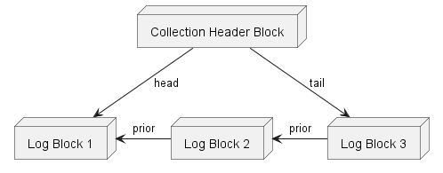
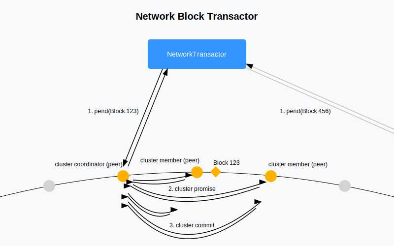
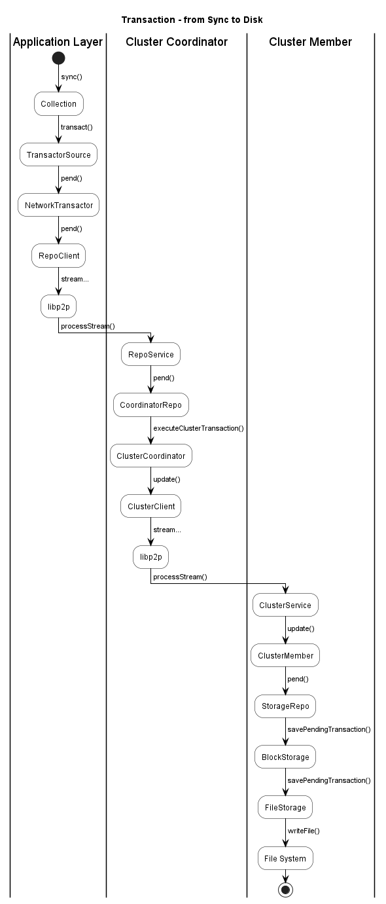

# Optimystic - Distributed Database System

## Overview

The transaction system described here uses a logical transaction log combined with block-based storage.  This scheme can be used as a stand-alone logging system, or can be coupled with a tree or other data structure.  This design is based on the transaction system of [AliveBase](https://github.com/Digithought).

This scheme employs a logical transaction log combined with block-based storage, supporting both single-collection and cross-collection transactions. The system utilizes a multi-phase process for propagating updates, committing transactions, and checkpointing affected blocks, ensuring consistency across distributed collections while allowing for concurrent operations through conditional commits.

The system may experience hotspots at the log tail block, but the tail is transient so these should distribute over time.  There is also the potential for cascading failures in upstream multi-collection transactions, but subsequent transactors are always free to investigate dependencies before committing.  Overall it offers a lockless design that enables transactions to proceed after retries, providing both flexibility and efficiency. The scheme also incorporates robust failure handling mechanisms, validation processes based on atomic writes and peer communication, and optimizations such as an optional sync phase and efficient advertisement of newer block transactions.

### Summary

#### Single collection transactions:
* Each collection maintains log of logical transactions, each with:
  * revision, transaction ID, block IDs, logical actions
* Logical log stored physically as linked list of blocks
* Log header block references head and tail block IDs
* Blocks each versioned by associated transaction ID and revision number - can read from previous revision back to history TTL
* Phase 1 - Pend: `pend()`s are posted to all affected blocks (w/ TTLs) - these don't update the revision
* Phase 2 - Commit: Transaction is appended to tail of the log, obtaining a new revision
* Phase 3 - Propagate: All affected blocks' revisions are updated
* Phase 4 - Checkpoint: Checkpoint record appended to tail block as propagation completes
* Before reading from collection, obtain outstanding transaction ID and revisions stated by checkpoint and intervening transactions
* Explicitly mention uncheckpointed and uncommited transactions when reading from block storage 
  - ensures read includes uncheckpointed and uncommitted transactions
  - reinforces commits (in case committer fails to propagate)

## Collections

A collection is the fundamental unit of data storage in Optimystic.  It consists of a transaction log, as well as a type-specific structure, such as a tree, all build on top of block storage.  It also represents the smallest scope of transaction processing.

Types of collections include:
* **Diary** - an append-only list of entries
* **Tree** - a dictionary or index like structure that stores entries in terms of a key based order
  * **Hashed Tree** - a tree where each node contains a hash of its children or entries (Merkle tree)

Each collection has a unique identifier, which is a reference to a block ID containing the collection's header.

For details, see [repository](./doc/repository.md).

## Transactor

A Transactor represents transactions against block storage independent of the underlying implementation.  Logical transactions are identified by a Transaction ID, which is also mirrored in the physical block repositories. The Transactor offers four core operations: 
- `get()` to retrieve the latest or a specific version of a set of blocks
- `pend()` to store the given block transforms as a pending transaction
- `cancel()` to cancel a pending transaction
- `commit()` to commit a pending transaction

Transactor operations, in general, apply to multiple blocks, and are split into multiple block-specific operations depending on the physical groupings of blocks.  For instance, an update transformation to both Block 1 and Block 2 may be turned into two separate update operations, one for Block 1 and one for Block 2 and sent to two separate block repositories.

## Transactions

Transactions are actions scoped to one or more collections.  There are three main layers to transactions:
* **Logical actions** - Actions applied to the collection are affected against the collection's logical structure (e.g. append to a tree), and the actions are also appended to the logical transaction log.
* **Block transforms** - Each logical action ultimately translates to block level transforms, including the appending of the transaction log, which is stored as a chain of blocks.
* **Cluster sub-transactions** - Peers who are in proximity to a block ID address on the network, have to coordinate the individual transaction sub-operations.

The transaction log is physically represented as a linked list of blocks, each containing a set of logical log entries.  The collection header block points to the tail block, and each block points to the prior block in the chain.

To apply a transaction to the blocks:
1. The client sends `pend()` requests to all involved blocks, containing the block transforms.  This allows the transform payload to be communicated to all involved blocks, prior to commitment.
2. The client specifically attempts to `commit()` the request to the tail block of the transaction log.  Successful commits to this block represent the "tip of the spear" for the transaction - if this commit succeeds, the transaction will ultimately succeed.
3. The client propagates the commit to the remaining involved blocks.
4. Once commit confirmation is received for all involved blocks, a checkpoint entry is appended to the transaction log.

Prior to checkpointing, the transaction is still complete, but client's must not assume that all block storage clusters have received the commit, so any `get()` requests should include the transaction ID / revision information, so that the storage repository will a) be informed of the commit; and b) be sure to retrieve the committed revision.

The resulting transaction model provides optimistic concurrency control, ensuring safe and reliable ACID mutations.  If a given transaction is stale, as in it is not "based on" the latest committed revision, the transaction will fail.  If this happens, the transaction must be retried as follows:
1. The client abandons its pending block operations
2. The winning transaction's logical actions are loaded by the client, and any conflicts resolved
3. The client replays its own logical actions into a new set of block transforms
4. The client attempts to pend and commit the new set of block transforms

## Distributed Transactions

Distributed transactions are affected by virtue of conditional transactions.  Here is how a DT is conducted:
* An attempt is made to appended all involved collection logs with a conditional transaction.  A promise signature is obtained from each tail maintenance cluster, indicating that this conditional transaction was successful.
* Once all needed promise signatures are obtained, the set of promises is propagated.
* Containing full promises, all log tails post a completion transaction.
* In the event that any of the above fails, e.g. a collection rejects the conditional due to it being stale, a compensatory transaction is appended to all logs to which a conditional was posted.  This compensatory transaction identifies the log entry, and undoes the operation of that entry.
* While the conditional transaction is outstanding, other transactors can choose to continue to transact, if their action doesn't conflict or depend on the final outcome, or they can wait for the outcome.

## Network Transactor & Clustering

The network transactor distributes a single transactional read or write operation (pend, commit, etc.) over the network of peers.  Each Block ID address is managed by a set of nearby (in hash space) peers, termed the block's *Cluster*.  There is a nested transaction scheme for transacting within each cluster; a variation of a two-phase commit (2PC) enriched with cryptographic signatures, decentralized verification, and a gossip-based finalization.  

For each block involved in the transaction, the network transactor selects a peer from that block's cluster to act as coordinator.  The portion of the payload that applies to a given coordinator is then sent to that coordinator.  A cluster coordinator validates the operation and sends the operation request in parallel to all members of the cluster for independent validation and a promise signature.  If all, or sufficient promises are received prior to the operation expiration, the coordinator signs a commit signature and broadcasts the set of signatures back out to the cluster for commit signatures.  Once the coordinator receives a consensus of commit signatures, it can affect the operation on it's local storage, and respond the the network transactor, and propagate the consensus back out to the cluster peers.

In the event that the operation's expiration arrives, any peer left in-doubt can reach out to other peers in the cluster.  Possession of a consensus of commit signatures, however gathered, constitutes proof that the transaction succeeded.  Possession of a consensus of commit rejection signatures constitutes proof of transaction failure.  Cluster peers continue to propagate signature records around to each other until the transaction goes to success or failure.  If the originator doesn't receive a response from the coordinator by the expiration, it can reach out to any other of the cluster peers for an update on the operation's status.

## Block Storage

Block Storage is composed of:
* **Revisions** - a set of revisions, each of which contains:
  * **Transform** - the changes represented by the revision
  * **Materialized block (optional)** - materialization of the block at that revision
* **Pending transforms** - pending transforms, which can be requested as part of a `get()` operations, and/or committed to the block

If a revision is requested that is not materialized, the block storage will materialize the block, using an older materialization and the necessary transforms.

Block Storage may choose to sweep old revisions and materialized blocks to free up space.  If an older revision is needed, the storage system will attempt to retrieve it from an archive.

## Archival Storage

VoteTorrent's archival storage system, called **Arachnode**, organizes storage nodes into concentric rings, with each ring representing progressively finer partitions of the keyspace. The outermost ring, called Ring Zulu, handles transactions and dynamic ranges based on an overlap factor rather than specific partition boundaries. Any storage nodes in the innermost ring, ring 0, would store the entire keyspace, while nodes in outer rings manage smaller, more specific portions of the keyspace. This design allows nodes to adjust their range responsibility based on storage capacity, dynamically shifting to more granular rings when needed.

Nodes in Arachnode maintain references to neighboring nodes within their ring and across adjacent inner and outer rings to facilitate data propagation and retrieval. As storage capacity reaches its limit, a node moves outward, adjusting its range and offloading excess data to nodes in the inner rings. This self-organizing system balances load across the rings, with global demand monitored through overlap factor sampling. This adaptive structure provides scalable, efficient storage management, with nodes dynamically adjusting their participation in rings to meet the system’s overall storage and processing needs.

For details, see [Arachnode](./doc/arachnode.md).

## Transaction Client

### Block mirroring
* The client should read and maintain a synchronized copy of all participant blocks from the repository
* The first read for any collection should be from the header block, which points to the tail of the logical log, which should be the second read
* With the LSN and the uncheckpointed transaction IDs in hand, the client can read any other blocks that may be part of the collection
* All changes to blocks should be tracked locally along with the logical log entries
* Modifications to blocks should be made into copies, maintaining the original versions
  
### Synchronization

#### When to sync
* If much time has passed since the blocks were read, the client should sync before posting pending updates
* Syncing will also be necessary if the transaction is rejected due to stale data

#### How to sync
* To sync, the client will:
  * Load new logical log entries from the tail block
  * Starting from unmodified cached blocks, play the read logical log entries, capturing physical changes in "unchanged" blocks
  * Note any conflicts from the loaded logical log entries, from our list - affect our list if necessary
  * Play our logical log entries, capturing physical changes as changed blocks and transforms

## Blocks

### Structures

#### Log Block:
- [**Previous Block ID**]: The ID of the prior block in the chain
- **Starting Log Sequence Number**: A monotonically increasing number for log entries - the LSN of the first committed entry in the block.
- **Entries**: list of:
  - **Transaction ID**: The ID of the transaction
  - **Operations**: A set of logical operations

#### Block Repository:
- **Pending**: list of:
  - **Transaction ID**: Used to identify the transaction while pending
  - **Transform**: The set of physical mutations to this block
  - **Expiration**: A time after which the transaction becomes in-doubt; this block should proactively determine resolution at this point
- **Revisions**: list of:
  - **LSN**: The LSN of this version
  - **Transform**: The set of physical mutations represented by this revision
  - [**Block**]: Materialized block for this revision - always present for current version
  - [**Expiration**]: The time after which this revision is eligible for garbage collection - never present for current version
  - **Conditions**: list of zero or more:
    - **Block ID**: Other block on which this revision is conditional
    - [**Signature**]: The signature of the other block - presence indicates that this revision is checkpointed
- **Aborted Revisions**: list of revisions that have been aborted

- **Commits**: corresponds to committed entries -list of:
  - **Conditional Collection IDs**: RemainingIDs of collections that are conditionally depended on

#### Block Transaction:
- **Block ID**: The ID of the block
- **Transaction ID**: The ID of the transaction - shared across blocks and collections
- **Transform**: The set of physical mutations to the block
- **Expiration**: A time after which the transaction becomes in-doubt; any involved node should proactively determine resolution at this point

#### Block Repository Interface

#### Block Network Interface

- `Pend(blockTransaction, failIfPending: boolean): success<pending: blockTransaction[]> | failure<missing: blockTransaction[]>` - posts a pending transaction for the block
  - Does not update the version of the block, but the transaction is available for explicit reading, and for committing
  - If the transaction targets the correct version, the call succeeds, unless failIfPending and there are any pending transactions - the caller may choose to wait for pending transactions to clear rather than risk racing with them
  - If the transaction targets an older version, the call fails, and the caller must resync using the missing transactions
  
- `Cancel(id): void` - cancels a pending transaction
  - If the given transaction ID is pending, it is canceled

- `Commit(id): conditions | failure<missing: blockTransaction[]>`
  - If the transaction references the current version, the pending transaction is conditionally committed
    - The returned conditions are those uncommitted inherited from older transaction(s) - if any of those are aborted, this transaction will implicitly be aborted
    - If the transaction mentions other collections, those are assumed conditions - returned conditions only list inherited conditions
  - If posting from an old version, unknown transactions are returned in the failure - must resync

- `Abort(id): void` - aborts a conditional committed transaction
  - Aborts the conditional transaction on all blocks

#### Block
- Block header
- Block body

#### Transform
- Set of block inserts, updates, and deletes

#### Overall Transaction
-Set of block transforms

The logical structure of a transaction can be represented as follows:

## Failure handling

#### Failure to propagate
#### Failure to commit
#### Failure to prepare
#### Failure to checkpoint
#### Effect on successive transactions

## Validation
* Block level validation is based on the distributed storage system; this system assumes a block repository with atomic writes as long as posting from most recent version
* General pattern is that all transaction phases are dictated by TTLs; if the coordinator/client fails to notify any party by the TTL, the party is to reach out to peers to resolve
* Each phase requires all parties to acknowledge before moving on
* TODO: distributed, signature based validation of log tail writes, and general block writes

## Optimizations
* Optional Phase 0 - Sync: Read latest LSN and integrate before wasting time posting pending updates
* Optimization - when posting pending updates, note any unknown block transactions - sync needed

