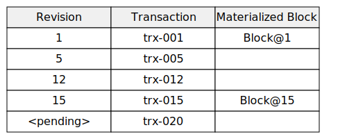

# Block Repository

## Overview

This document outlines the design for a Block Repository that provides efficient access to versioned data. The system manages blocks of data with versioning capabilities, allowing users to retrieve blocks at specific versions, update blocks conditionally, and mark blocks for eventual deletion.

The system provides these core operations through the `IBlockNetwork` interface:
- `get(blockGets[])`: Fetch blocks by their IDs and versions or specific transactions
- `getStatus(trxRefs[])`: Get statuses of block transactions
- `pend(blockTrx)`: Post a transaction for a set of blocks
- `cancel(trxRef)`: Cancel a pending transaction
- `commit(tailId, trxRef)`: Commit a pending transaction

## Clusters

The Block Repository is designed around peer proximity in the DHT network.  Each peer is responsible for at least transactional (short term) storage of blocks in the address proximity, thus a given Block's storage is distributed across multiple peers (the "cluster").  When performing operations on a cluster, a client will choose a "coordinator" peer, which may be arbitrarily chosen, or chosen based on past performance or ID proximity.  The coordinator is responsible for coordinating the operation across the cluster, for the given transaction.

Here is how a transaction proceeds for a given cluster:
1. The coordinator receives the mutation (e.g. pend, commit, cancel), validates it, puts it in a record with a TTL, signs its own promise on it, then sends it in parallel to all other peers in the cluster.
2. If the coordinator receives a promise from the necessary number of peers, it, in parallel, responds with success to the client, and propagates the record with its own signed completion to the other peers in the cluster. 

* If the coordinator does not receive a promise from the necessary number of peers, before the TTL expires, or it receives failures, is signs as a failure and returns failures to the client.
* If the client looses connection to the coordinator, it can retry with a new coordinator.
* Peers will not sign their promise on a transaction that contradicts a previous transaction until the prior transaction is known to have failed or succeeded.  If a new coordinator is chosen, it will have to confirm consensus on the prior attempt before proceeding.
* If Peers receive invalid requests from other peers, they will whisper with the other peers to exclude the invalid peer from the cluster in the future.

## Repository Operations Description

### 1. `get(blockGets[])`

- **Purpose**: Fetch blocks by their IDs and versions or a specific transaction
- **Input**: Array of `BlockGet` objects containing:
  - `blockId` - A unique identifier for the block
  - `context` - Optional transaction context specifying either a revision or pending transaction
- **Output**: Array of `GetBlockResult` objects containing:
  - `block` - The block data
  - `state` - Current block state including latest revision or deletion status
- **Behavior**: 
  - If no context is provided, returns the latest version
  - If a revision is specified, returns the block at that revision
  - If a transaction ID is specified, returns the block with pending changes applied
  - Fails if requesting a deleted block with pending transaction

### 2. `pend(blockTrx)`

- **Purpose**: Post a transaction for a set of blocks
- **Input**: `PendRequest` containing:
  - `transform` - The changes to apply
  - `trxId` - Transaction identifier
  - `pending` - How to handle existing pending transactions
- **Output**: `PendResult` indicating success or failure with pending transaction information
- **Behavior**:
  - Creates metadata for new blocks if needed
  - Can fail if pending='fail' and other transactions are pending
  - Saves block-specific transforms for each affected block

### 3. `cancel(trxRef)`

- **Purpose**: Cancel a pending transaction
- **Input**: `TrxBlocks` containing block IDs and transaction ID
- **Behavior**: Removes the pending transaction from all specified blocks

### 4. `commit(tailId, trxRef)`

- **Purpose**: Commit a pending transaction
- **Input**:
  - `tailId` - Block ID
  - `trxRef` - Transaction reference
- **Output**: `CommitResult` indicating success or missing transactions needed
- **Behavior**:
  - Verifies expected revision matches current state
  - Updates block metadata and revision
  - Promotes pending transaction to committed state
  - Handles block deletion if specified in transform

## Block Storage Repository

Block Storage Repository nodes maintain the following state information:
- Latest revision number
- Deletion status (if applicable)
- Pending transactions
- Materialized versions at specific revisions

The system uses a materialization strategy where:
- Blocks can be materialized at any revision by applying transforms sequentially
- Materialized versions are cached to improve performance
- Pending transactions can be applied on top of any materialized version

## Transaction Processing

Transactions go through the following lifecycle:
1. **Pending**: Posted via `pend()` but not yet committed
2. **Committed**: Applied to blocks and assigned a revision number
3. **Materialized**: Full block state computed and cached at specific revisions

The system supports:
- Optimistic concurrency through revision checking
- Transaction conflict detection
- Block restoration through callback mechanism
- Materialization caching for performance

## Block Lifecycle

* **Creation**: Blocks are created through insert transforms
* **Updates**: Applied through pending and committed transactions
* **Deletion**: Marked via delete transform, maintaining revision history

Revisions within a block also have a lifecycle:
* **Archival**: Older revisions Blocks are archived based on resource pressure, access recency/frequency, or other criteria
* **Restoration**: Previous versions can be restored from archival storage as needed

## Implementation Notes

The system is implemented with these key components:
- `StorageRepo`: Main implementation of the repository operations
- `IBlockStorage`: Interface for block storage operations
- `RestoreCallback`: Optional mechanism for block restoration

The storage layer maintains separate stores for:
- Block metadata (e.g. latest revision, deletion status)
- Revisions
- Transactions (both pending and committed)
- Materialized block versions
